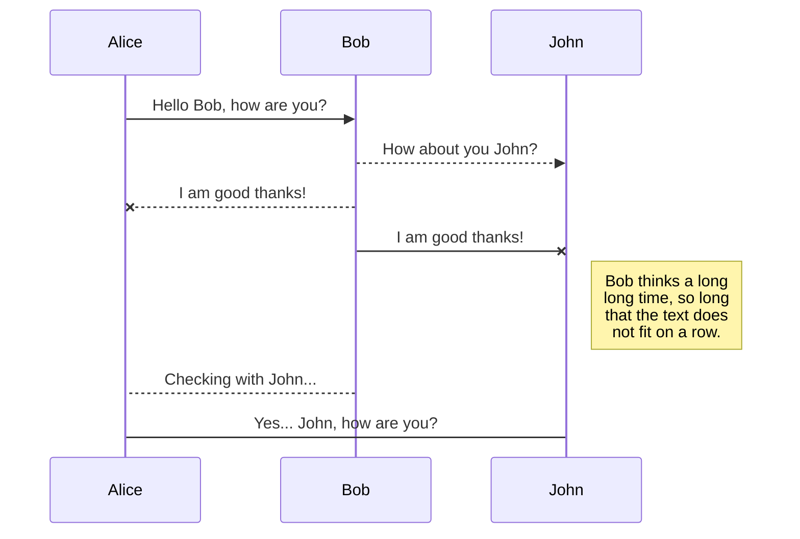

A sample page

Lorem ipsum dolor sit amet, consectetur adipiscing elit. Maecenas bibendum semper urna. Etiam mi nisi, suscipit ut tristique ac, interdum eu nibh. Nullam lacinia lacus ac erat facilisis, vel condimentum neque vulputate. Etiam rhoncus vulputate enim sed ornare. Nullam in orci id turpis eleifend fermentum aliquam non augue. Nunc non cursus nisi. Sed euismod ex massa, eu ornare nunc elementum sit amet. Curabitur imperdiet sagittis tempor. Aliquam ac elit eget eros rhoncus viverra. Sed viverra diam quis ex sagittis maximus. Maecenas ac malesuada sapien. Ut facilisis dignissim risus, a accumsan metus bibendum nec. Sed eget sapien a quam porta mattis ut et ante. Aenean dui nibh, vestibulum sed quam sit amet, aliquet cursus arcu.

Duis ipsum justo, fringilla a risus at, rhoncus tincidunt nunc. Proin iaculis pellentesque sem, quis mattis erat tristique eget. Nam eget maximus elit, nec pharetra diam. Vivamus at justo vel erat tincidunt hendrerit eget eu massa. Curabitur pellentesque nulla nunc, nec eleifend neque molestie sed. Curabitur vitae erat purus. Praesent ante eros, consequat sed vehicula nec, hendrerit auctor massa. Praesent vitae pulvinar turpis. Nulla diam nibh, porta et libero vitae, malesuada rutrum tortor. Donec volutpat tincidunt justo eu condimentum. In eget nibh a lacus pellentesque mattis. Nullam ac pretium nulla.
